# QA Hackathon

> for screenshots please refer to `sss` folder.

## api-3; create a new user
on create a new user on dev when we enter username that already exists it saving with empty username but email validation is working fine. however on release it is not saving the user with same username and email. it says username already exists, and email already exists.

## api-22; create a new user
on create a new user on dev it gives 500 internal server error everytime. however on release it is working fine.

## api-21; list all users
on list all users on dev it returns:

```json
{
  "meta": {
    "total": 0
  },
//   ...
}
```

however on release it returns:

```json
{
  "meta": {
    "total": 10
  },
//   ...
}
```

## api-6; list all users

on list all users on dev it returns ( correct data ). offset=0

```json
{
  "meta": {
    "total": 9
  },
    "users": [
    {
      "avatar_url": "",
      "email": "max2@gmail.com",
      "name": "Max1",
      "nickname": "",
      "uuid": "9a208228-1fa0-4df8-ab3a-f83f1a6ed2af"
    },
    {
      "avatar_url": "",
      "email": "max8@gmail.com",
      "name": "Max",
      "nickname": "",
      "uuid": "9881fa6d-bbc1-4f7d-970c-be7f740287a2"
    },
    {
      "avatar_url": "",
      "email": "max4@gmail.com",
      "name": "Max",
      "nickname": "",
      "uuid": "ad4ee916-5312-4f89-a1bf-c36ac832e206"
    },
    {
      "avatar_url": "",
      "email": "max7@gmail.com",
      "name": "Max",
      "nickname": "",
      "uuid": "636ee455-d8dd-48eb-9579-99538c7ff781"
    },
    {
      "avatar_url": "",
      "email": "max5@gmail.com",
      "name": "Max",
      "nickname": "",
      "uuid": "8ed1e2da-eaaa-4ff1-990a-06bf51f86a9d"
    },
    {
      "avatar_url": "",
      "email": "max1@gmail.com",
      "name": "Max1",
      "nickname": "max1",
      "uuid": "3cfe26ab-5455-49fa-a173-020adaa2d52d"
    },
    {
      "avatar_url": "",
      "email": "max3@gmail.com",
      "name": "Max",
      "nickname": "max3",
      "uuid": "c2c8f767-85b4-47ec-b0e0-e76aefe9e209"
    },
    {
      "avatar_url": "",
      "email": "max6@gmail.com",
      "name": "Max",
      "nickname": "max4",
      "uuid": "29ec2e32-bdb2-49c7-8a8c-765b67bf66b1"
    },
    {
      "avatar_url": "",
      "email": "max9@gmail.com",
      "name": "Max",
      "nickname": "max9",
      "uuid": "515ce5db-c923-4025-82ca-59b604e32355"
    }
  ]
}
```

when offset=10 it returns all data again:

```json
{
  "meta": {
    "total": 9
  },
//   ...all data...
}
```

however on release it returns empty list when offset=10:

```json
{
  "meta": {
    "total": 9
  },
  "users": []
}
```

when offset=0 it returns all data:

```json
{
  "meta": {
    "total": 9
  },
//   ...all data...
}
```

## api-23; get user by uuid

actual data ( from api-21; list all users ):

```json
{
    "avatar_url": "",
    "email": "max@gmail.com",
    "name": "Max",
    "nickname": "max",
    "uuid": "301a848e-e74f-42eb-b656-724745e61a59"
}
```

it returns wrong data on dev:

```json
{
  "avatar_url": "",
  "email": "max5@gmail.com",
  "name": "Max",
  "nickname": "",
  "uuid": "8ed1e2da-eaaa-4ff1-990a-06bf51f86a9d"
}
```

however on release it returns correct data:

```json
{
  "avatar_url": "",
  "email": "max@gmail.com",
  "name": "Max",
  "nickname": "max",
  "uuid": "301a848e-e74f-42eb-b656-724745e61a59"
}
```

```json
AssertionError: UUID mismatch on dev (expected bug): {"avatar_url":"","email":"max8@gmail.com","name":"Max","nickname":"","uuid":"9881fa6d-bbc1-4f7d-970c-be7f740287a2"}
```

`515ce5db-c923-4025-82ca-59b604e32355`; on dev returns:
```json
{
  "avatar_url": "",
  "email": "max7@gmail.com",
  "name": "Max",
  "nickname": "",
  "uuid": "636ee455-d8dd-48eb-9579-99538c7ff781"
}
but in actual:
{
    "avatar_url": "",
    "email": "max9@gmail.com",
    "name": "Max",
    "nickname": "max9",
    "uuid": "515ce5db-c923-4025-82ca-59b604e32355"
}
```

## api-1; delete user by uuid
on release it's deleting. however on dev it's giving 500 internal server error.

## api-7; get aser by credentials
on dev it's giving 404 not found error. however on release it's working fine.
```bash
assert response.status_code == 200, f"Failed on dev: {response.text}"
AssertionError: Failed on dev: {"code":404,"message":"Could not find user with given credentials"}
```

## api-9; get a game by uuid
```bash
Release Environment Response Status Code: 200
Release Environment Response Text: {"category_uuids":["8126d35b-5336-41ad-981d-f245c3e05665"],"price":4999,"title":"Uncharted 4: A Thief's End","uuid":"5449c9d0-3399-44e1-bd63-f6cbb62c38ea"}

Dev Environment Response Status Code: 404
Dev Environment Response Text: {"code":404,"message":"Could not find game with \"uuid\": 5449c9d0-3399-44e1-bd63-f6cbb62c38ea"}
```

## api-10; get games by category

```bash
Release Environment Response Status Code: 200
Release Environment Response Text: {"games":[{"category_uuids":["e86aecef-fe7a-4164-a324-57503df14ab9"],"price":5999,"title":"Atomic Heart","uuid":"1990ecdd-4d3d-4de2-91b9-d45d794c82bc"}],"meta":{"total":1}}

Dev Environment Response Status Code: 200
Dev Environment Response Text: {"games":[{"category_uuids":["78fcb98b-d820-4d79-a049-e2089b7ce87a"],"price":5999,"title":"Elden Ring","uuid":"03dbad48-ad81-433d-9901-dd5332f5d9ee"},{"category_uuids":["78fcb98b-d820-4d79-a049-e2089b7ce87a"],"price":2499,"title":"The Elder Scrolls V: Skyrim","uuid":"09531e2b-c3eb-4338-a002-cc4817a7cc58"},{"category_uuids":["78fcb98b-d820-4d79-a049-e2089b7ce87a"],"price":999,"title":"The Witcher 3: Wild Hunt","uuid":"06520f6e-5096-4d49-a044-136357737eff"}],"meta":{"total":3}}

Release Environment Response Status Code: 404
Release Environment Response Text: {"code":404,"message":"no matching operation was found"}

Dev Environment Response Status Code: 404
Dev Environment Response Text: {"code":404,"message":"no matching operation was found"}

Release Environment Response Status Code: 200
Release Environment Response Text: {"games":[{"category_uuids":["e86aecef-fe7a-4164-a324-57503df14ab9"],"price":5999,"title":"Atomic Heart","uuid":"1990ecdd-4d3d-4de2-91b9-d45d794c82bc"}],"meta":{"total":1}}

Traceback (most recent call last):
  File "/Users/abdibrokhim/VSCode/hackathons/qahack/getgamesbycat.py", line 119, in <module>
    run_tests()
  File "/Users/abdibrokhim/VSCode/hackathons/qahack/getgamesbycat.py", line 116, in run_tests
    test_get_games_by_category_with_pagination()
  File "/Users/abdibrokhim/VSCode/hackathons/qahack/getgamesbycat.py", line 97, in test_get_games_by_category_with_pagination
    assert len(data["games"]) == limit, f"Expected {limit} games, got {len(data['games'])}"
           ^^^^^^^^^^^^^^^^^^^^^^^^^^^
AssertionError: Expected 5 games, got 1
```

Here are the detailed bug reports for the issues observed in the **release** and **dev** environments based on the test output.

---

**Bug Report 1: Mismatched Games Data (Release vs Dev)**

**Summary**:  
The response from the release environment returns one game, while the response from the dev environment returns three games. This discrepancy in the number of games is a potential issue related to missing or incorrect game data in one of the environments.

**Details**:
- **Release Environment**:  
  - **Response Status Code**: `200 OK`  
  - **Response Text**:  
    ```json
    {
      "games": [
        {
          "category_uuids": ["e86aecef-fe7a-4164-a324-57503df14ab9"],
          "price": 5999,
          "title": "Atomic Heart",
          "uuid": "1990ecdd-4d3d-4de2-91b9-d45d794c82bc"
        }
      ],
      "meta": {
        "total": 1
      }
    }
    ```
  - **Expected Result**: The release environment should return the same data as the dev environment (i.e., multiple games should be returned).
  - **Actual Result**: Only one game is returned, which is inconsistent with the dev environment's response.

- **Dev Environment**:  
  - **Response Status Code**: `200 OK`  
  - **Response Text**:  
    ```json
    {
      "games": [
        {
          "category_uuids": ["78fcb98b-d820-4d79-a049-e2089b7ce87a"],
          "price": 5999,
          "title": "Elden Ring",
          "uuid": "03dbad48-ad81-433d-9901-dd5332f5d9ee"
        },
        {
          "category_uuids": ["78fcb98b-d820-4d79-a049-e2089b7ce87a"],
          "price": 2499,
          "title": "The Elder Scrolls V: Skyrim",
          "uuid": "09531e2b-c3eb-4338-a002-cc4817a7cc58"
        },
        {
          "category_uuids": ["78fcb98b-d820-4d79-a049-e2089b7ce87a"],
          "price": 999,
          "title": "The Witcher 3: Wild Hunt",
          "uuid": "06520f6e-5096-4d49-a044-136357737eff"
        }
      ],
      "meta": {
        "total": 3
      }
    }
    ```
  - **Expected Result**: The dev environment should match the release environment in terms of the games returned.
  - **Actual Result**: Three games are returned, which might indicate that the release environment data is incomplete or not synchronized with the dev environment.

---

**Bug Report 2: 404 Error for Undefined Operation**

**Summary**:  
Both the release and dev environments return a `404 Not Found` error for the same operation. This could be caused by incorrect routing or missing operations in the API definition.

**Details**:
- **Release Environment**:  
  - **Response Status Code**: `404 Not Found`  
  - **Response Text**:  
    ```json
    {
      "code": 404,
      "message": "no matching operation was found"
    }
    ```
  - **Expected Result**: A `404` error is returned when the resource or operation cannot be found, which is the expected behavior for an invalid or non-existent request.
  - **Actual Result**: The error message "no matching operation was found" suggests that the endpoint might not be registered or that the request is malformed, though this was expected for some invalid cases.

- **Dev Environment**:  
  - **Response Status Code**: `404 Not Found`  
  - **Response Text**:  
    ```json
    {
      "code": 404,
      "message": "no matching operation was found"
    }
    ```
  - **Expected Result**: A similar behavior in the dev environment if the requested operation is invalid.
  - **Actual Result**: The same `404` error is returned in both environments, which suggests a consistent issue related to either the endpoint definition or routing in both environments.

---

**Bug Report 3: Pagination Issue - Incorrect Number of Games Returned**

**Summary**:  
The test for pagination fails because the dev environment returns fewer games than expected. This issue could be related to incorrect handling of the `limit` and `offset` parameters.

**Details**:
- **Release Environment**:  
  - **Response Status Code**: `200 OK`  
  - **Response Text**:  
    ```json
    {
      "games": [
        {
          "category_uuids": ["e86aecef-fe7a-4164-a324-57503df14ab9"],
          "price": 5999,
          "title": "Atomic Heart",
          "uuid": "1990ecdd-4d3d-4de2-91b9-d45d794c82bc"
        }
      ],
      "meta": {
        "total": 1
      }
    }
    ```
  - **Expected Result**: When using `limit=5` and `offset=0`, the release environment should return a list of 5 games, as specified by the test parameters.
  - **Actual Result**: Only 1 game is returned in the response, which is incorrect.

- **Dev Environment**:  
  - **Response Status Code**: `200 OK`  
  - **Response Text**:  
    ```json
    {
      "games": [
        {
          "category_uuids": ["78fcb98b-d820-4d79-a049-e2089b7ce87a"],
          "price": 5999,
          "title": "Elden Ring",
          "uuid": "03dbad48-ad81-433d-9901-dd5332f5d9ee"
        },
        {
          "category_uuids": ["78fcb98b-d820-4d79-a049-e2089b7ce87a"],
          "price": 2499,
          "title": "The Elder Scrolls V: Skyrim",
          "uuid": "09531e2b-c3eb-4338-a002-cc4817a7cc58"
        },
        {
          "category_uuids": ["78fcb98b-d820-4d79-a049-e2089b7ce87a"],
          "price": 999,
          "title": "The Witcher 3: Wild Hunt",
          "uuid": "06520f6e-5096-4d49-a044-136357737eff"
        }
      ],
      "meta": {
        "total": 3
      }
    }
    ```
  - **Expected Result**: When `limit=5` and `offset=0` are set, the dev environment should return 5 games, or if there are fewer than 5 games available, it should return all available games. The `meta` data should also reflect the total number of available games (e.g., `total=3`).
  - **Actual Result**: The response includes only 3 games, but the test expected 5 games. Since there are only 3 games in the dev environment, this discrepancy causes the pagination test to fail.


list of games:

games:
```json
{
  "games": [
    {
      "category_uuids": [
        "e86aecef-fe7a-4164-a324-57503df14ab9"
      ],
      "price": 5999,
      "title": "Atomic Heart",
      "uuid": "1990ecdd-4d3d-4de2-91b9-d45d794c82bc"
    },
    {
      "category_uuids": [
        "ac949f6c-80f5-40dd-9723-0cd47706060e"
      ],
      "price": 5999,
      "title": "Baldur's Gate 3",
      "uuid": "0378c074-92d6-4d8c-b6d3-878c08dbe27f"
    },
    {
      "category_uuids": [
        "78fcb98b-d820-4d79-a049-e2089b7ce87a"
      ],
      "price": 5999,
      "title": "Elden Ring",
      "uuid": "03dbad48-ad81-433d-9901-dd5332f5d9ee"
    },
    {
      "category_uuids": [
        "a24db271-1e09-4ddc-b40b-3f2b8875c00b"
      ],
      "price": 2499,
      "title": "Forza Horizon 5",
      "uuid": "cb620f56-daa4-43e0-b4a0-e80f8e5be279"
    },
    {
      "category_uuids": [
        "8126d35b-5336-41ad-981d-f245c3e05665"
      ],
      "price": 2999,
      "title": "Red Dead Redemption 2",
      "uuid": "aca79a7c-5b66-4ff2-b3b8-57e56fc053a7"
    },
    {
      "category_uuids": [
        "78fcb98b-d820-4d79-a049-e2089b7ce87a"
      ],
      "price": 2499,
      "title": "The Elder Scrolls V: Skyrim",
      "uuid": "09531e2b-c3eb-4338-a002-cc4817a7cc58"
    },
    {
      "category_uuids": [
        "8126d35b-5336-41ad-981d-f245c3e05665"
      ],
      "price": 1999,
      "title": "The Last of Us",
      "uuid": "77a94eec-38e0-4a08-a3d7-2be1007ef686"
    },
    {
      "category_uuids": [
        "5af3642a-2d97-40d1-aa82-c7f8758863fd"
      ],
      "price": 1999,
      "title": "The Sims 4",
      "uuid": "12dc6bb3-cd3f-412a-86fe-3c1dce867481"
    },
    {
      "category_uuids": [
        "78fcb98b-d820-4d79-a049-e2089b7ce87a"
      ],
      "price": 999,
      "title": "The Witcher 3: Wild Hunt",
      "uuid": "06520f6e-5096-4d49-a044-136357737eff"
    },
    {
      "category_uuids": [
        "8126d35b-5336-41ad-981d-f245c3e05665"
      ],
      "price": 4999,
      "title": "Uncharted 4: A Thief's End",
      "uuid": "5449c9d0-3399-44e1-bd63-f6cbb62c38ea"
    }
  ],
  "meta": {
    "total": 10
  }
}
```

## api-25; add item to users wishlist
on both versions it doesn't saying that item already exists in wishlist.
```bash

---Testing Add Item to Wishlist---
Testing Add Item to Wishlist in environment: https://release-gs.qa-playground.com/api/v1
Updated Wishlist in https://release-gs.qa-playground.com/api/v1: {'items': [{'category_uuids': ['78fcb98b-d820-4d79-a049-e2089b7ce87a'], 'price': 999, 'title': 'The Witcher 3: Wild Hunt', 'uuid': '06520f6e-5096-4d49-a044-136357737eff'}], 'user_uuid': '515ce5db-c923-4025-82ca-59b604e32355'}

Testing Add Item to Wishlist in environment: https://dev-gs.qa-playground.com/api/v1
Updated Wishlist in https://dev-gs.qa-playground.com/api/v1: {'items': [{'category_uuids': ['78fcb98b-d820-4d79-a049-e2089b7ce87a'], 'price': 999, 'title': 'The Witcher 3: Wild Hunt', 'uuid': '06520f6e-5096-4d49-a044-136357737eff'}, {'category_uuids': ['78fcb98b-d820-4d79-a049-e2089b7ce87a'], 'price': 999, 'title': 'The Witcher 3: Wild Hunt', 'uuid': '06520f6e-5096-4d49-a044-136357737eff'}], 'user_uuid': '515ce5db-c923-4025-82ca-59b604e32355'}
```
it's adding the same item twice in wishlist on dev.

## api-5; add item to users wishlist
```bash
(.venv) abdibrokhim@Ibrohims-MacBook-Pro qahack % python3 wishlist.py

---Testing Add Item to Wishlist---
Testing Add Item to Wishlist in environment: https://release-gs.qa-playground.com/api/v1
Updated Wishlist in https://release-gs.qa-playground.com/api/v1: {'items': [{'category_uuids': ['5af3642a-2d97-40d1-aa82-c7f8758863fd'], 'price': 1999, 'title': 'The Sims 4', 'uuid': '12dc6bb3-cd3f-412a-86fe-3c1dce867481'}, {'category_uuids': ['8126d35b-5336-41ad-981d-f245c3e05665'], 'price': 1999, 'title': 'The Last of Us', 'uuid': '77a94eec-38e0-4a08-a3d7-2be1007ef686'}], 'user_uuid': '515ce5db-c923-4025-82ca-59b604e32355'}
Testing Add Item to Wishlist in environment: https://dev-gs.qa-playground.com/api/v1
Traceback (most recent call last):
  File "/Users/abdibrokhim/VSCode/hackathons/qahack/wishlist.py", line 87, in <module>
    test_add_to_wishlist_5(user_uuid, game_uuid)  # Valid user UUID and game UUID
    ^^^^^^^^^^^^^^^^^^^^^^^^^^^^^^^^^^^^^^^^^^^^
  File "/Users/abdibrokhim/VSCode/hackathons/qahack/wishlist.py", line 56, in test_add_to_wishlist_5
    assert response.status_code == 200, f"Failed to add item in {base_url}: {response.text}"
           ^^^^^^^^^^^^^^^^^^^^^^^^^^^
AssertionError: Failed to add item in https://dev-gs.qa-playground.com/api/v1: {"code":422,"message":"Wishlist limit is reached: 10"}
```
on `release`:
```json
{
  "items": [
    {
      "category_uuids": [
        "5af3642a-2d97-40d1-aa82-c7f8758863fd"
      ],
      "price": 1999,
      "title": "The Sims 4",
      "uuid": "12dc6bb3-cd3f-412a-86fe-3c1dce867481"
    },
    {
      "category_uuids": [
        "8126d35b-5336-41ad-981d-f245c3e05665"
      ],
      "price": 1999,
      "title": "The Last of Us",
      "uuid": "77a94eec-38e0-4a08-a3d7-2be1007ef686"
    }
  ],
  "user_uuid": "515ce5db-c923-4025-82ca-59b604e32355"
}
```
on `dev`:
```json
{"code":422,"message":"Wishlist limit is reached: 10"}
```

## api-8; remove item from users wishlist
it's not removing the item from wishlist on `dev`. 
it's removing the item from wishlist on `release`.

## api-11; update user's avatar
update failing on `dev`.

## api-12; list all items in user's cart
do not counting total price. it's still 0:
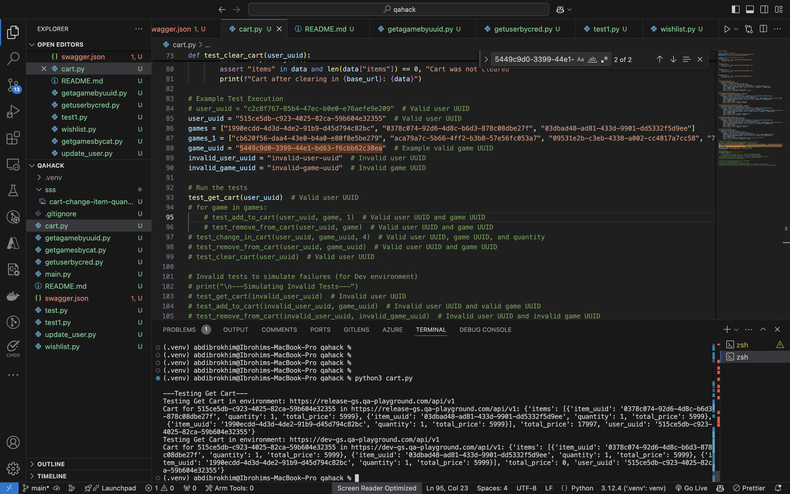


## api-13; change an item in user's cart
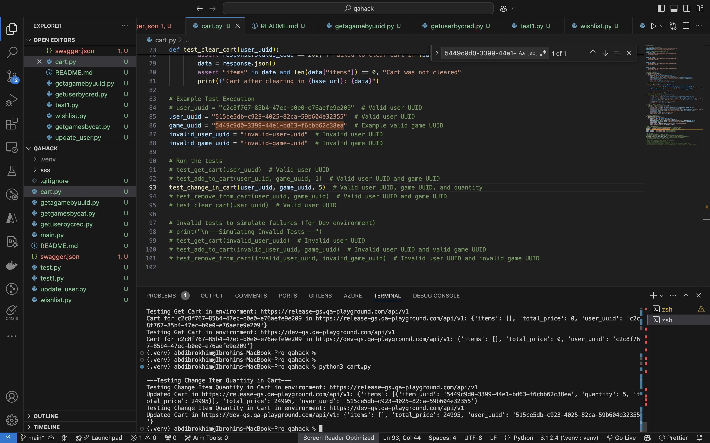
```bash
---Testing Change Item Quantity in Cart---
Testing Change Item Quantity in Cart in environment: https://release-gs.qa-playground.com/api/v1
Updated Cart in https://release-gs.qa-playground.com/api/v1: {'items': [{'item_uuid': '5449c9d0-3399-44e1-bd63-f6cbb62c38ea', 'quantity': 5, 'total_price': 24995}], 'total_price': 24995, 'user_uuid': '515ce5db-c923-4025-82ca-59b604e32355'}
Testing Change Item Quantity in Cart in environment: https://dev-gs.qa-playground.com/api/v1
Updated Cart in https://dev-gs.qa-playground.com/api/v1: {'items': [], 'total_price': 24995, 'user_uuid': '515ce5db-c923-4025-82ca-59b604e32355'}
```
`note:` cart is not updating on `dev`.


## api-14; remove an item from user's cart
it's removing all items from cart.

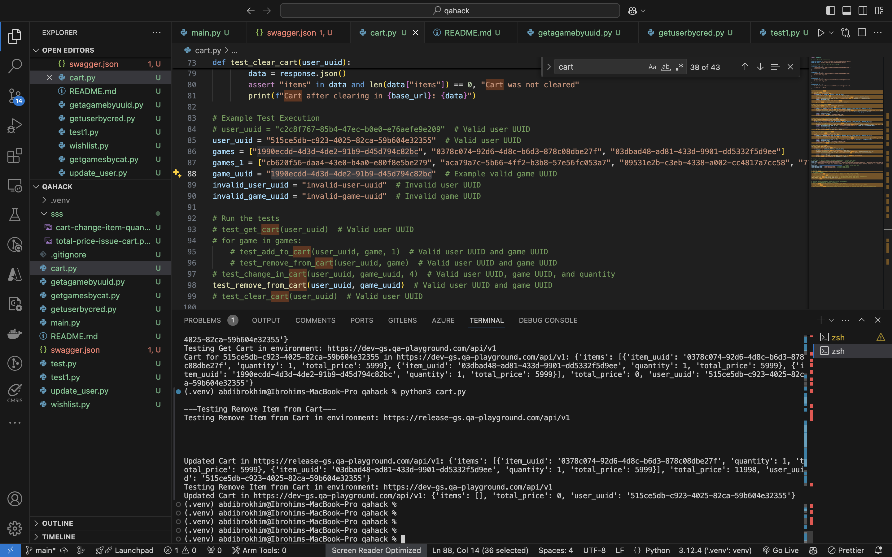


## api-15; clear user's cart
no issue with this api.
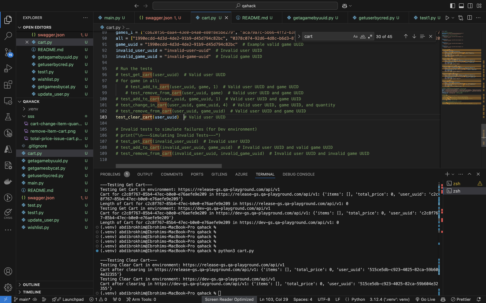


## api-16; create a new order
duplicating orders

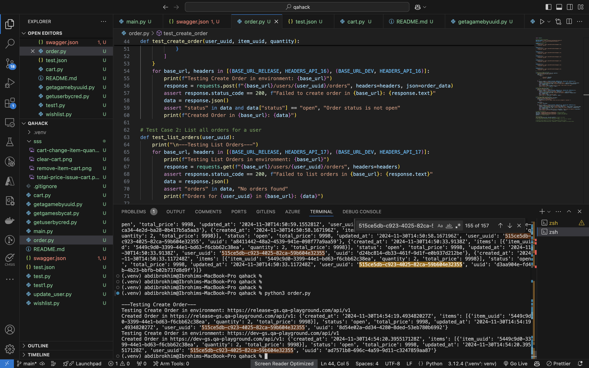 

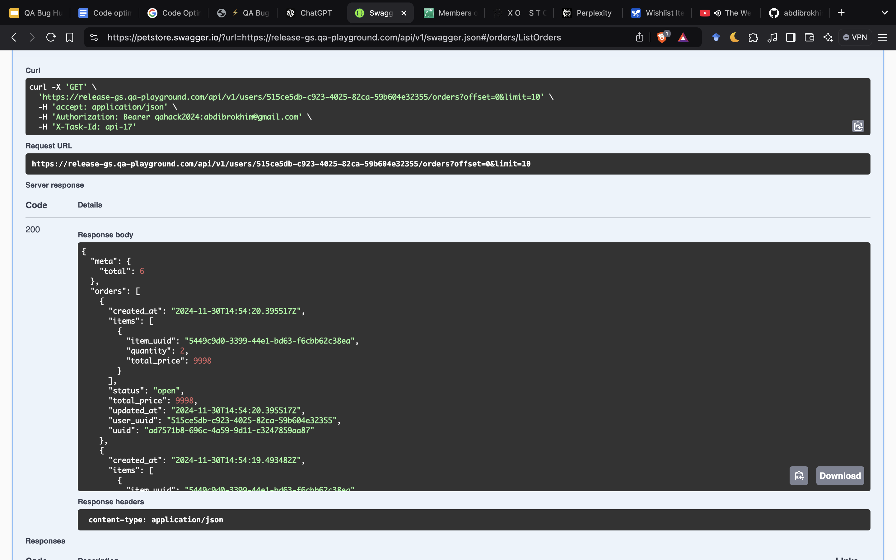


## api-17; list all orders for a user
so far no issue with this api.


## api-18; change order status

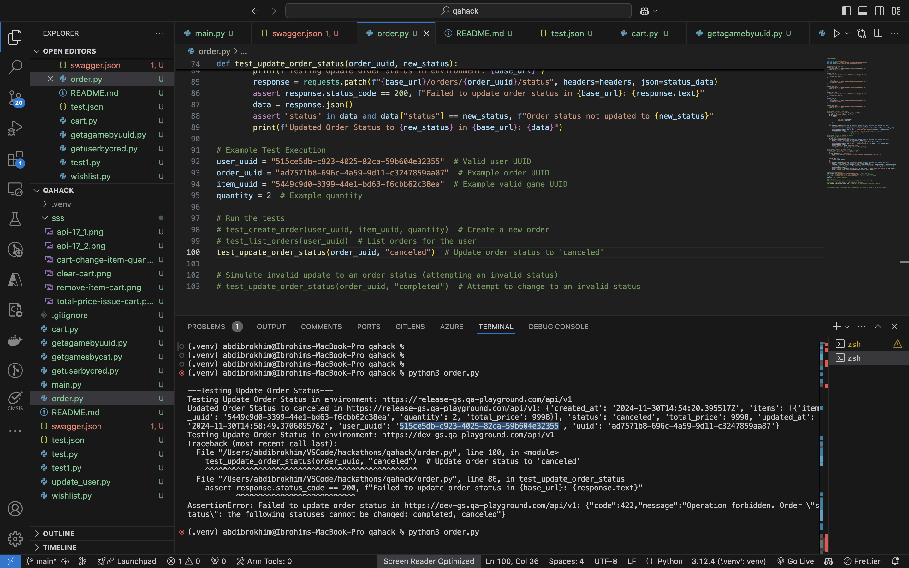

update issue on `dev`. even it's `open` it's not updating to other.

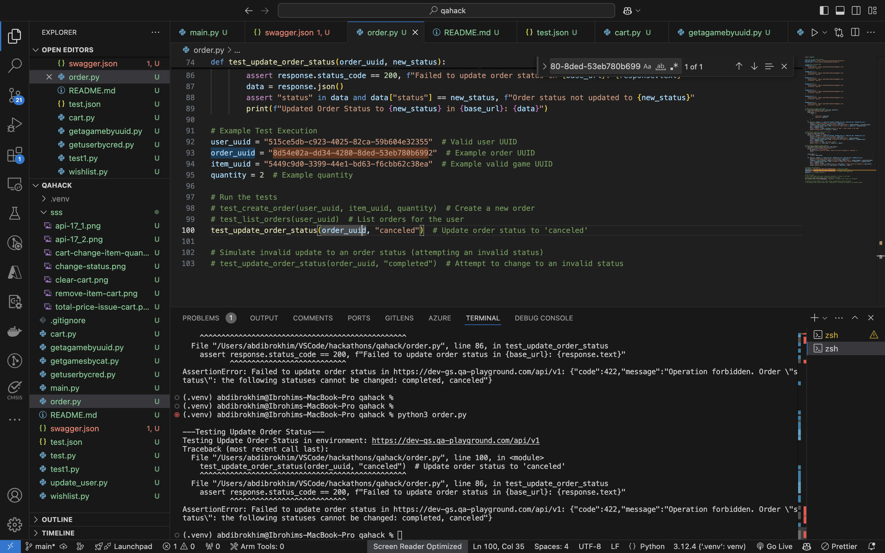

## api-19; get a payment by uuid
so far no issue with this api.


## api-20; in `release` even order status is `completed` it's creating payment.
```bash
---Testing Create Payment---
Testing Create Payment in environment: https://release-gs.qa-playground.com/api/v1
Created Payment in https://release-gs.qa-playground.com/api/v1: {'amount': 9998, 'created_at': '2024-11-30T17:51:53.077825317Z', 'order_uuid': '7f82919e-ca34-4e2d-ba28-0b417b5a5aa3', 'payment_method': 'card', 'status': 'processing', 'updated_at': '2024-11-30T17:51:53.077825317Z', 'user_uuid': '515ce5db-c923-4025-82ca-59b604e32355', 'uuid': '9f85899c-978d-4504-b037-5311aefa7f7c'}
Testing Create Payment in environment: https://dev-gs.qa-playground.com/api/v1
Traceback (most recent call last):
  File "/Users/abdibrokhim/VSCode/hackathons/qahack/payment.py", line 74, in <module>
    test_create_payment(user_uuid, order_uuid, payment_method)  # Create a new payment
    ^^^^^^^^^^^^^^^^^^^^^^^^^^^^^^^^^^^^^^^^^^^^^^^^^^^^^^^^^^
  File "/Users/abdibrokhim/VSCode/hackathons/qahack/payment.py", line 50, in test_create_payment
    assert response.status_code == 200, f"Failed to create payment in {base_url}: {response.text}"
           ^^^^^^^^^^^^^^^^^^^^^^^^^^^
AssertionError: Failed to create payment in https://dev-gs.qa-playground.com/api/v1: {"code":422,"message":"Operation forbidden. Order \"status\": payment can be created only for an order with status 'open'"}
```

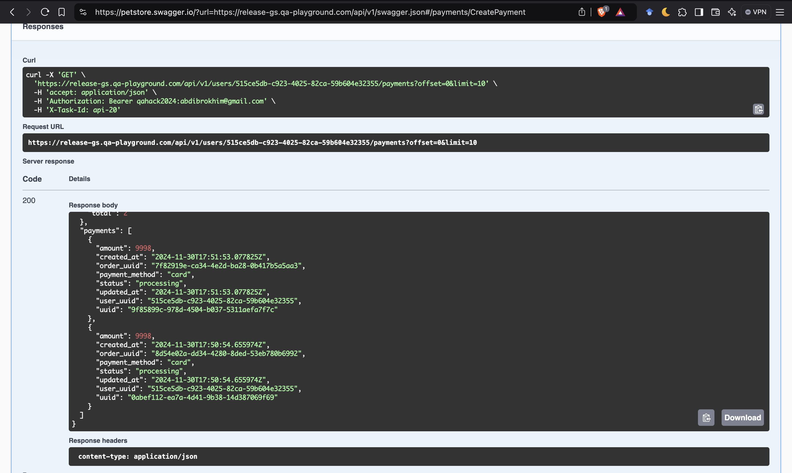 

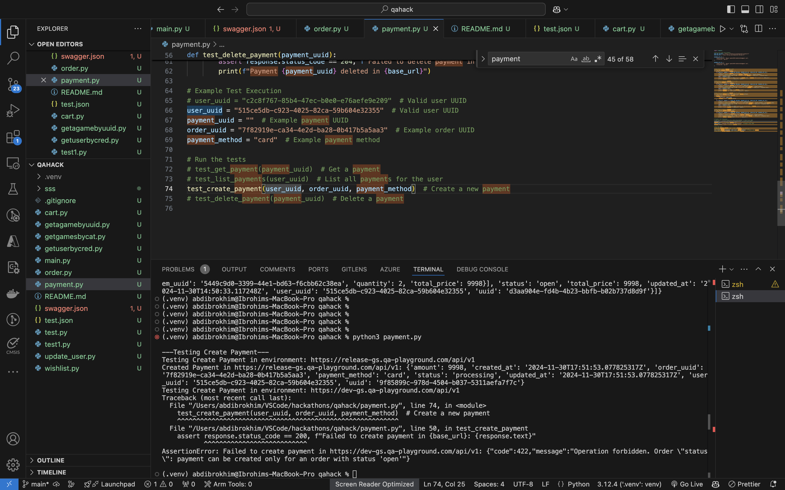

## api-2; search game

search working fine on `release` ; returning correct games.

search_query = "The" :

```json
{
  "games": [
    {
      "category_uuids": [
        "78fcb98b-d820-4d79-a049-e2089b7ce87a"
      ],
      "price": 2499,
      "title": "The Elder Scrolls V: Skyrim",
      "uuid": "09531e2b-c3eb-4338-a002-cc4817a7cc58"
    },
    {
      "category_uuids": [
        "8126d35b-5336-41ad-981d-f245c3e05665"
      ],
      "price": 1999,
      "title": "The Last of Us",
      "uuid": "77a94eec-38e0-4a08-a3d7-2be1007ef686"
    },
    {
      "category_uuids": [
        "5af3642a-2d97-40d1-aa82-c7f8758863fd"
      ],
      "price": 1999,
      "title": "The Sims 4",
      "uuid": "12dc6bb3-cd3f-412a-86fe-3c1dce867481"
    },
    {
      "category_uuids": [
        "78fcb98b-d820-4d79-a049-e2089b7ce87a"
      ],
      "price": 999,
      "title": "The Witcher 3: Wild Hunt",
      "uuid": "06520f6e-5096-4d49-a044-136357737eff"
    }
  ],
  "meta": {
    "total": 4
  }
}
```

on `dev` it's returning list of all games.


## api-24; update a user
os far no issue with this api.

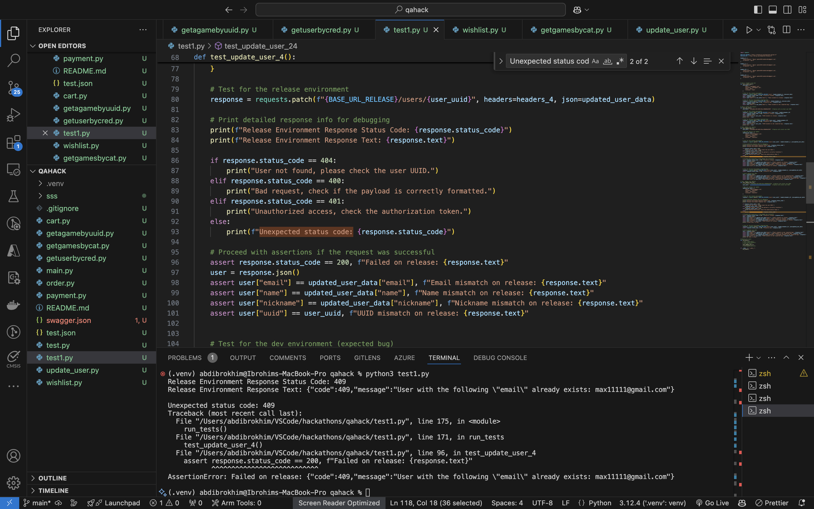


## api-4; update a user
so far no issue with this api.


